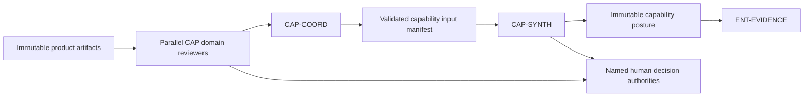

# Capability Agent Framework

The capability layer converts immutable product artifacts into end-to-end, cross-product assessments of requirements, interfaces, mission execution, human factors, risk, architecture, governance, tradeoffs, and readiness. All roles inherit the [Universal Agent Contract](../../contracts/universal-agent-contract.md) and [Capability Delivery Contract](../../contracts/capability-delivery-contract.md). Coordination additionally follows the [Deterministic Capability Coordination Contract](../../contracts/capability-coordination-contract.md).

## Canonical workflow

Domain reviewers answer separate authoritative questions and do not modify one another's outputs. `CAP-COORD` is a deterministic validation and routing boundary: it inventories the exact review population and preserves all conflicts without deriving capability meaning. `CAP-SYNTH` may run only when a workflow admits it and the coordinator manifest satisfies the pinned completeness and eligibility policy. Human acceptance gates remain separate records.

## Registered roles

The table describes the intended capability topology, not scheduling status. Baseline roles have specified contracts; `CAP-REQ` and `CAP-SYNTH` are admitted candidates subject to their human and workflow gates.

| Designation | Role | Status | Primary result |
|---|---|---|---|
| `CAP-REQ` | Requirements Traceability Reviewer | candidate | Requirement-to-evidence records, coverage, gaps, and acceptance requests |
| `CAP-XPROD` | Cross-Product Reviewer | baseline | Interface, dependency, compatibility, and shared-assumption posture |
| `CAP-RISK` | Capability Risk Reviewer | baseline | Emergent capability risks, confidence, and treatment options |
| `CAP-MISSION` | Mission Thread Analysis Agent | baseline | End-to-end mission execution and failure-point assessment |
| `CAP-HCD` | Human-Centered Design Evaluator | baseline | Operator journey, handoff, effort, clarity, and resilience posture |
| `CAP-ARCH` | Capability Architecture Reviewer | baseline | Cross-product architecture coherence and mission alignment |
| `CAP-TRADE` | Capability Trade-Study Reviewer | baseline | Evidence-backed alternatives, tradeoffs, sensitivity, and uncertainty |
| `CAP-GOV` | Capability Governance Reviewer | baseline | Applicable obligations, exceptions, approvals, and governance gaps |
| `CAP-PROGRESS` | Capability Progress and Readiness Reviewer | baseline | Evidence-backed convergence toward intended capability outcomes |
| `CAP-COORD` | Capability Coordinator | baseline | Exact, validated, traceable capability-review input manifest |
| `CAP-SYNTH` | Capability Synthesis Lead | candidate | Sourced capability posture, preserved conflicts, confidence, and enterprise handoff |

## Shared gates

- Capability ID, participating products, mission scope, source revisions, expected review population, schemas, integrity, lineage, freshness, compatibility, and version pins are validated before routing.
- Requirement satisfaction is assessed only against authoritative declared requirements; absent requirements produce an unassessable state, never implicit satisfaction.
- Cross-product assertions cite contributing product or capability artifacts and preserve domain confidence, uncertainty, gaps, and conflict.
- `CAP-COORD` has validation-and-routing authority only. `CAP-SYNTH` has synthesis authority only. Neither can approve readiness, accept risk, change requirements, authorize release, alter reports, or authorize deployment.
- Human responses, independent administrative verification, derived eligibility, synthesis scheduling, and production promotion remain separate state-machine transitions.
- Production execution targets the NVIDIA A100 large cluster. All testing runs on NVIDIA DGX Spark or an approved equivalent with the execution environment and limitations recorded.
