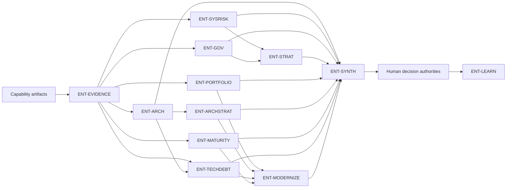

# Enterprise Agent Framework

The enterprise layer converts immutable capability evidence into traceable system-of-systems decision support. All roles inherit the [Universal Agent Contract](../../contracts/universal-agent-contract.md) and [Enterprise Agent Contract](../../contracts/enterprise-agent-contract.md).

## Canonical workflow

`ENT-EVIDENCE` is the normal input gate. A policy-authorized partial review may proceed only with an explicit `incomplete_input` state. Parallel enterprise reviewers do not modify each other's outputs. `ENT-SYNTH` correlates them and exposes disagreement; it does not overrule them.

## Registered roles

Identity, status, and specification paths are generated from the registry in the [agent catalog](../generated/agent-catalog.md). The table below remains explanatory framework content.

The table describes the intended enterprise topology, not scheduling authority. `ENT-EVIDENCE` and `ENT-SYSRISK` are baseline; `ENT-ARCH`, `ENT-GOV`, `ENT-STRAT`, and `ENT-SYNTH` are admitted but unscheduled candidates; the remaining roles are planned.

| Designation | Role | Status | Primary result |
|---|---|---|---|
| `ENT-EVIDENCE` | Evidence Validation Gate | baseline | Validated enterprise input manifest |
| `ENT-ARCH` | Systems Architecture Reviewer | candidate | System-of-systems architecture posture |
| `ENT-SYSRISK` | Systemic Risk Reviewer | baseline | Enterprise systemic risk register |
| `ENT-GOV` | Enterprise Governance Reviewer | candidate | Cross-capability governance posture |
| `ENT-STRAT` | Strategic Scoring Agent | candidate | Traceable strategic confidence distribution |
| `ENT-PORTFOLIO` | Portfolio Analysis Agent | planned | Duplication, concentration, and portfolio options |
| `ENT-ARCHSTRAT` | Architecture Strategy Agent | planned | Target-state and roadmap alignment |
| `ENT-MATURITY` | Maturity Evaluator | planned | Configuration-driven maturity assessment |
| `ENT-TECHDEBT` | Technical Debt Prioritizer | planned | Enterprise debt trajectory and priorities |
| `ENT-MODERNIZE` | Investment and Modernization Advisor | planned | Options, tradeoffs, and sequencing |
| `ENT-LEARN` | Learning and Metrics Agent | planned | Quality, drift, and outcome feedback |
| `ENT-SYNTH` | Enterprise Synthesis Agent | candidate | Coherent enterprise posture and decision brief |

## Shared gates

- Identity and schema validation precede scheduling.
- Every derived assertion preserves capability provenance.
- Confidence reconciliation retains distributions, uncertainty, and disagreement.
- Human decisions are separate, immutable linked records.
- Learning output can propose sandbox experiments but cannot alter production agents.
- Production execution targets the NVIDIA A100 large cluster. All testing runs on NVIDIA DGX Spark or an approved equivalent, with environment deltas and limitations retained.
