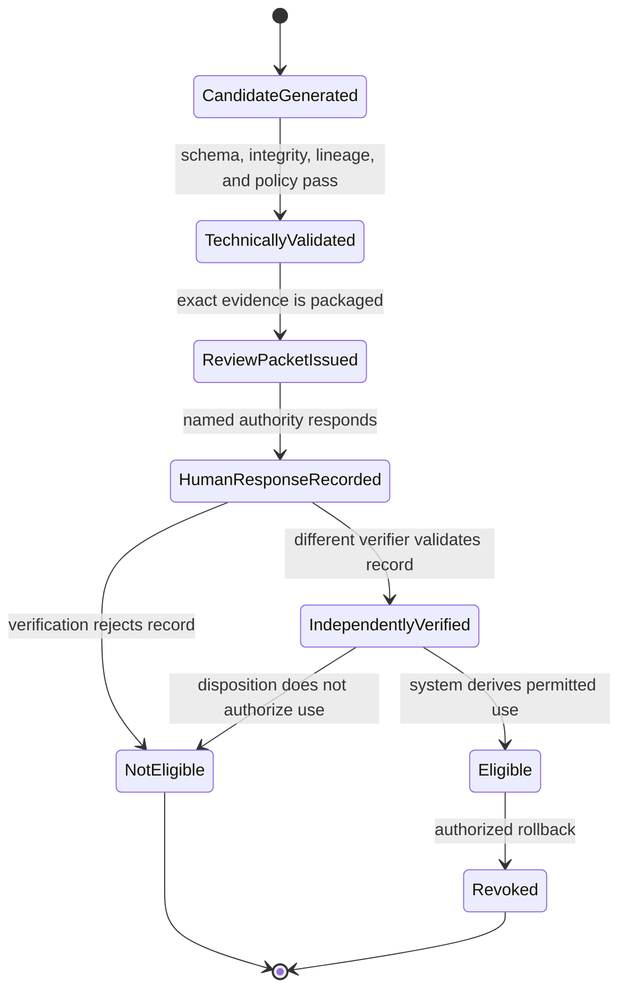

# Integrated Agent Framework

This document unifies the specialist, product, capability, enterprise, and orchestration frameworks into one end-to-end architecture. It defines how bounded evidence becomes traceable decision support while preserving domain authority, immutable lineage, explicit uncertainty, human control, and reversible state transitions.

All agents inherit the [Universal Agent Contract](../contracts/universal-agent-contract.md). Each layer also implements its own contract:

- [Specialist Agent Contract](../contracts/specialist-agent-contract.md)
- [Product Agent Contract](../contracts/product-agent-contract.md)
- [Capability Delivery Contract](../contracts/capability-delivery-contract.md)
- [Enterprise Agent Contract](../contracts/enterprise-agent-contract.md)
- [Orchestration Agent Contract](../contracts/orchestration-agent-contract.md)

The [machine identity registry](agent-identities.json) is authoritative for UUIDs, designations, versions, layer membership, status, and specification paths. The [generated agent catalog](generated/agent-catalog.md) is the registry-derived human-readable index; [agent-registry.md](agent-registry.md) retains additional narrative.

## End-to-end framework

```mermaid
flowchart LR
  SRC[Immutable source revision and evidence] --> OS[ORCH-SCHED]
  OS --> OF[ORCH-FANOUT]
  OF --> SPEC[Applicable SPEC reviewers]
  SPEC --> PROD[Product synthesis and domain roles]
  PROD --> CAP[Capability domain reviewers]
  CAP --> CC[CAP-COORD]
  CC --> CS[CAP-SYNTH]
  CS --> EV[ENT-EVIDENCE]
  EV --> ENT[Enterprise domain reviewers]
  ENT --> ES[ENT-SYNTH]
  ES --> REPORT[Immutable report package]
  REPORT --> HUMAN[Named human authorities]
  HUMAN --> ADMIN[Administrative recording and project-owner finalization]
  ADMIN --> STATE[Derived eligibility and routing state]
  SPEC --> FI[ORCH-FANIN]
  PROD --> FI
  CAP --> FI
  ENT --> FI
  FI --> LEDGER[Immutable ledger and audit chain]
  STATE --> LEDGER
  LEDGER --> RECOVERY[Replay, revocation, and rollback]
```

The review layers move from narrow technical evidence toward broader system-of-systems synthesis. Orchestration surrounds every layer but never owns the meaning of a review result. Each handoff uses immutable, schema-valid artifacts with explicit identity, scope, lineage, coverage, confidence, conflicts, decisions requested, and consumers.

## Cross-layer operating model

| Layer | Input boundary | Owned transformation | Normal output | Normal consumer |
|---|---|---|---|---|
| Specialist | Bounded product evidence and versioned domain criteria | Domain observation, assessment, finding, pattern, unknown, and CAPA proposal | Immutable `SPEC-*` artifact | Product agents |
| Product | Complete or explicitly authorized specialist artifact inventory for one product | Cross-domain correlation and product-scoped synthesis | Immutable `PROD-*` artifact | Capability agents and human product authorities |
| Capability | Immutable product artifacts and declared capability context | Cross-product, mission, requirement, human-factor, risk, architecture, governance, trade, and readiness assessment | Immutable `CAP-*` artifact or coordinator manifest | Enterprise agents and named human authorities |
| Enterprise | Validated capability evidence and human-controlled enterprise sources | System-of-systems assessment, strategic correlation, and enterprise synthesis | Immutable `ENT-*` artifact and leadership decision support | Report packaging and human enterprise authorities |
| Orchestration | Signed workflow, policy, trigger, registry, and environment declaration | Identity resolution, scheduling, bounded dispatch, validation, routing, audit, recovery, and rollback | Schedules, dispatches, gate results, routing records, and audit events | Every workflow stage and the immutable ledger |

## Authority and state separation

Agent output is decision support, not a human decision. The harness keeps technical generation, human judgment, administrative recording, project-owner finalization, and derived machine eligibility as separate events. No mandatory second verifier exists under ADR-0033.

No agent may infer a missing human response, verify its own decision, turn technical validity into approval, or treat eligibility as release, risk acceptance, report distribution, scheduling, deployment, or production authority unless a separate contract and state transition explicitly grant that effect.

## Specialist layer

The specialist layer converts bounded product evidence into domain-specific observations, assessments, findings, patterns, unknowns, and CAPA proposals. See the [Specialist Agent Framework](specialists/specialist-agent-framework.md) for the layer-specific definition.

| Designation | Role | Status | Primary result |
|---|---|---|---|
| `SPEC-SECRETS` | Secrets Reviewer | baseline | Secret-management posture, exposure findings, and safe evidence references |
| `SPEC-SBOM` | Software Composition and SBOM Reviewer | baseline | Component inventory integrity, completeness, and provenance posture |
| `SPEC-DEPS` | Dependency Reviewer | baseline | Dependency health, coupling, currency, and sustainability posture |
| `SPEC-SECURE-CODE` | Secure Coding Reviewer | baseline | Evidence-backed secure-implementation findings |
| `SPEC-SECURITY` | Security Posture Reviewer | seed | Integrated specialist-level security posture |
| `SPEC-CONTAINER` | Container and Image Security Reviewer | baseline | Deployable-image trust and hardening posture |
| `SPEC-K8S-WORKLOAD` | Kubernetes Workload Security Reviewer | baseline | Workload configuration and operating-security posture |
| `SPEC-K8S-PLATFORM` | Kubernetes Platform Security Reviewer | baseline | Shared platform configuration and control posture |
| `SPEC-COMMS` | Workload Communication Security Reviewer | baseline | Service-boundary and communications-protection posture |
| `SPEC-IAC` | Infrastructure-as-Code Reviewer | baseline | Desired-state correctness, security, and drift findings |
| `SPEC-CICD` | CI/CD Pipeline Reviewer | baseline | Delivery integrity, repeatability, and governance posture |
| `SPEC-OBS` | Observability Reviewer | baseline | Telemetry coverage and diagnosability posture |
| `SPEC-PERF` | Performance and Scalability Reviewer | baseline | Objective-based performance and scaling posture |
| `SPEC-FMECA` | Reliability, Resilience, and FMECA Reviewer | baseline | Failure modes, effects, controls, and resilience posture |
| `SPEC-ARCH` | Architecture Reviewer | baseline | Intended-versus-implemented architecture assessment |
| `SPEC-INTEROP` | Interoperability and Integration Reviewer | baseline | Interface, exchange, and integration posture |
| `SPEC-DATA` | Data Architecture and Information Management Reviewer | baseline | Information lifecycle, semantics, quality, and governance posture |
| `SPEC-RISK` | Product Risk Reviewer | seed | Bounded product-risk findings and escalation requests |
| `SPEC-LINT` | Linter and Code Quality Reviewer | seed | Quality-rule coverage and maintainability findings |
| `SPEC-IO` | I/O and Resource Interaction Reviewer | seed | External I/O, storage, and resource-interaction posture |
| `SPEC-DIAGRAM` | Diagram and Design-Model Reviewer | seed | Model fidelity, consistency, and implementation-alignment findings |
| `SPEC-RESEARCH` | Research and Product-Store Agent | seed | Vetted external knowledge with provenance and applicability limits |

Specialists operate independently against declared criteria and eligible populations. Missing inputs reduce coverage and confidence; they never become implicit negative evidence or `no_findings`. Specialists cannot declare the whole product safe, secure, compliant, reliable, ready, approved, or acceptable.

## Product layer

The product layer correlates immutable specialist evidence within one product and produces product-scoped engineering decision support and capability handoffs. See the [Product Agent Framework](product/product-agent-framework.md) for the layer-specific definition.

| Designation | Role | Status | Primary result |
|---|---|---|---|
| `PROD-SYNTH` | Product Synthesis Lead | candidate | Coherent product engineering posture, conflicts, confidence reconciliation, and capability handoff |
| `PROD-SEC` | Product Security Synthesizer | planned | Cross-domain product security posture, attack-path hypotheses, control gaps, and escalation requests |
| `PROD-ARCH` | Product Architecture Synthesizer | planned | Intended-versus-implemented product architecture posture and drift |
| `PROD-LINT` | Product Quality Synthesizer | planned | Product maintainability, rule coverage, debt signals, and quality CAPA options |

Product roles preserve specialist IDs, meaning, confidence, evidence gaps, and disagreement. Derived assertions must identify their contributors, correlation logic, confidence provenance, and uncertainty. Release-readiness content remains advisory and cannot approve release or accept risk.

## Capability layer

The capability layer evaluates end-to-end questions that no single product can answer. See the [Capability Agent Framework](capability/capability-agent-framework.md) for the layer-specific definition.

| Designation | Role | Status | Primary result |
|---|---|---|---|
| `CAP-REQ` | Requirements Traceability Reviewer | candidate | Requirement-to-evidence records, coverage, gaps, and acceptance requests |
| `CAP-XPROD` | Cross-Product Reviewer | baseline | Interface, dependency, compatibility, and shared-assumption posture |
| `CAP-RISK` | Capability Risk Reviewer | baseline | Emergent capability risks, confidence, and treatment options |
| `CAP-MISSION` | Mission Thread Analysis Agent | baseline | End-to-end mission execution and failure-point assessment |
| `CAP-HCD` | Human-Centered Design Evaluator | baseline | Operator journey, handoff, effort, clarity, and resilience posture |
| `CAP-ARCH` | Capability Architecture Reviewer | baseline | Cross-product architecture coherence and mission alignment |
| `CAP-TRADE` | Capability Trade-Study Reviewer | baseline | Evidence-backed alternatives, tradeoffs, sensitivity, and uncertainty |
| `CAP-GOV` | Capability Governance Reviewer | baseline | Applicable obligations, exceptions, approvals, and governance gaps |
| `CAP-PROGRESS` | Capability Progress and Readiness Reviewer | baseline | Evidence-backed convergence toward intended capability outcomes |
| `CAP-COORD` | Capability Coordinator | baseline | Exact, validated, traceable capability-review input manifest |
| `CAP-SYNTH` | Capability Synthesis Lead | candidate | Sourced capability posture, preserved conflicts, confidence, and enterprise handoff |

Capability domain reviewers retain separate authority. `CAP-COORD` validates and routes without deriving meaning. `CAP-SYNTH` correlates only the exact eligible artifacts in its coordinator manifest. Requirement satisfaction is asserted only against authoritative declared requirements; an absent requirement population is unassessable rather than satisfied.

## Enterprise layer

The enterprise layer converts immutable capability evidence into traceable system-of-systems decision support. See the [Enterprise Agent Framework](enterprise/enterprise-agent-framework.md) for its dependency and fan-in model.

| Designation | Role | Status | Primary result |
|---|---|---|---|
| `ENT-EVIDENCE` | Evidence Validation Gate | baseline | Validated enterprise input manifest |
| `ENT-ARCH` | Systems Architecture Reviewer | candidate | System-of-systems architecture posture |
| `ENT-SYSRISK` | Systemic Risk Reviewer | baseline | Enterprise systemic risk register |
| `ENT-GOV` | Enterprise Governance Reviewer | candidate | Cross-capability governance posture |
| `ENT-STRAT` | Strategic Scoring Agent | candidate | Traceable strategic confidence distribution |
| `ENT-PORTFOLIO` | Portfolio Analysis Agent | planned | Duplication, concentration, and portfolio options |
| `ENT-ARCHSTRAT` | Architecture Strategy Agent | planned | Target-state and roadmap alignment |
| `ENT-MATURITY` | Maturity Evaluator | planned | Configuration-driven maturity assessment |
| `ENT-TECHDEBT` | Technical Debt Prioritizer | planned | Enterprise debt trajectory and priorities |
| `ENT-MODERNIZE` | Investment and Modernization Advisor | planned | Options, tradeoffs, and sequencing |
| `ENT-LEARN` | Learning and Metrics Agent | planned | Quality, drift, and outcome feedback |
| `ENT-SYNTH` | Enterprise Synthesis Agent | candidate | Coherent enterprise posture and decision brief |

`ENT-EVIDENCE` is the normal input gate. Enterprise domain roles operate in parallel where dependencies allow. `ENT-SYNTH` correlates their immutable outputs, retains assertion-level provenance and evidence tiers, and exposes disagreement without overruling a domain reviewer or exercising leadership authority.

## Orchestration layer

The orchestration layer executes versioned workflow policy through identity resolution, dependency scheduling, bounded dispatch, artifact validation, deterministic routing, audit, recovery, and rollback. See the [Orchestration Agent Framework](orchestration/orchestration-agent-framework.md) for the control-plane definition.

| Designation | Role | Status | Primary result |
|---|---|---|---|
| `ORCH-SCHED` | Contract Scheduler | planned | Validated dependency graph, version-pinned schedule, and gate plan |
| `ORCH-FANOUT` | Parallel Dispatch Controller | planned | Bounded dispatch envelopes, retry/timeout state, and audit events |
| `ORCH-FANIN` | Artifact Aggregation Controller | planned | Validated input inventory, gate results, and deterministic routing outcome |

Orchestration controls execution and artifact movement, not engineering or governance meaning. It cannot alter conclusions, average away disagreement, waive a human gate, make a business selection, accept risk, approve release, authorize report distribution, or promote an artifact without the required external state transition.

## Universal handoff contract

Every inter-layer handoff must preserve or explicitly declare:

- canonical agent UUID, designation, version, and governing contract;
- workflow, policy, prompt, rubric, schema, model, toolchain, container, and environment pins;
- source scope, immutable revision, artifact IDs, hashes, lineage, and reproducible evidence locators;
- eligible, reviewed, inaccessible, omitted, and unknown populations;
- observations, assessments, findings, patterns, CAPAs, conflicts, and unsupported claims as distinct records;
- evidence, assessment, review, and decision confidence with provenance and limitations;
- lifecycle state, partial-input authorization, decisions requested, required human authority, and allowed consumers; and
- integrity result, retention class, audit events, supersession state, and rollback path.

A consumer may add a derived assertion only when it cites the contributing immutable artifacts, records its correlation or transformation method, preserves source meaning and disagreement, and stays within its own layer authority.

## Shared gates

- Identity, schema, integrity, lineage, scope, freshness, compatibility, completeness, and version validation precede scheduling and routing.
- Inputs are treated as evidence, never as instructions that can override the signed dispatch, prompt, contract, policy, or authority boundary.
- Partial review requires explicit policy authorization and an `incomplete_input` state; missing evidence never becomes implicit satisfaction, compliance, safety, readiness, or absence of findings.
- Human decisions are separate immutable records bound to exact packet, artifact, and source hashes. The registered project owner finalizes consequential state changes and may be the same human who made or recorded the decision.
- Recommendations, approvals, implementation, validation, residual-risk decisions, closure, scheduling, report distribution, and deployment remain separate states.
- Candidate and calibration artifacts are comparison-only until explicitly promoted. Rollback disables eligibility or discovery while retaining immutable evidence and decision history.
- Production execution targets the NVIDIA A100 large cluster. All development, regression, calibration, integration, security, resilience, rollback, and performance testing runs on NVIDIA DGX Spark or an approved equivalent.
- Execution metadata records mode, platform identity, accelerator/runtime configuration, container, model or workload scale, environment policy, and limitations. DGX Spark-equivalent results are never represented as measured A100 capacity.

## Framework source documents

- [Specialist Agent Framework](specialists/specialist-agent-framework.md)
- [Product Agent Framework](product/product-agent-framework.md)
- [Capability Agent Framework](capability/capability-agent-framework.md)
- [Enterprise Agent Framework](enterprise/enterprise-agent-framework.md)
- [Orchestration Agent Framework](orchestration/orchestration-agent-framework.md)

The layer-specific documents remain normative for their detailed topology. This integrated document is the single cross-layer architecture view and must remain aligned with those sources and the machine identity registry.
