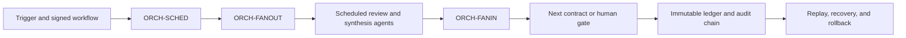

# Orchestration Agent Framework

The orchestration layer executes versioned workflow policy by resolving identities and dependencies, dispatching bounded work, validating returned artifacts, and routing immutable results. All roles inherit the [Universal Agent Contract](../../contracts/universal-agent-contract.md) and [Orchestration Agent Contract](../../contracts/orchestration-agent-contract.md).

## Canonical workflow

`ORCH-SCHED` resolves the executable graph and pins policy, identity, contracts, prompts, rubrics, models, tools, schemas, and environment. `ORCH-FANOUT` creates least-privilege dispatches for independent work. `ORCH-FANIN` validates returned artifacts and determines routing eligibility without reconciling their meaning. State machines govern retries, timeouts, partial-input authorization, human gates, verification, revocation, and rollback.

## Registered roles

Identity, status, and specification paths are generated from the registry in the [agent catalog](../generated/agent-catalog.md). The table below remains explanatory framework content.

The registered orchestration roles are planned control-plane roles. The repository's state machines and deterministic runtimes provide the current executable reference behavior; registration alone does not authorize production scheduling.

| Designation | Role | Status | Primary result |
|---|---|---|---|
| `ORCH-SCHED` | Contract Scheduler | planned | Validated dependency graph, version-pinned schedule, and gate plan |
| `ORCH-FANOUT` | Parallel Dispatch Controller | planned | Bounded dispatch envelopes, retry/timeout state, and audit events |
| `ORCH-FANIN` | Artifact Aggregation Controller | planned | Validated input inventory, gate results, and deterministic routing outcome |

## Shared gates

- Registered UUID/designation pairs, workflow and policy versions, acyclic dependencies, contract compatibility, and all execution pins are validated before scheduling.
- Dispatches use immutable inputs and least-privilege evidence, model, tool, credential, network, filesystem, and output permissions.
- Fan-in validates schema, integrity, lineage, provenance, freshness, coverage, compatibility, conflicts, CAPA structure, authority, and partial-input state before routing.
- Orchestration cannot alter a review conclusion, average away disagreement, waive a human gate, make an engineering or governance decision, accept risk, approve release, or promote an artifact.
- Human decisions, administrative recording, independent verification, eligibility derivation, distribution, scheduling, and deployment remain distinct events with immutable audit records.
- Production dispatch targets the NVIDIA A100 large cluster. Every test dispatch targets NVIDIA DGX Spark or an approved equivalent; mode/platform mismatch fails closed and promotion retains the signed environment delta and rollback evidence.
