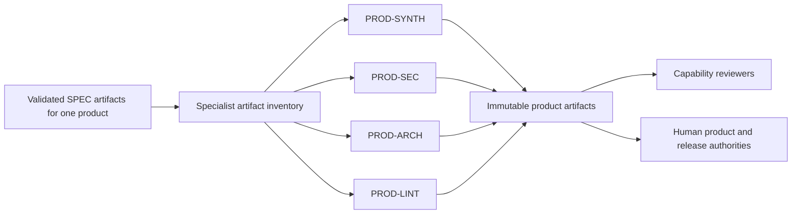

# Product Agent Framework

The product layer correlates immutable specialist evidence within one product and produces product-scoped engineering decision support and capability handoffs. All roles inherit the [Universal Agent Contract](../../contracts/universal-agent-contract.md) and [Product Agent Contract](../../contracts/product-agent-contract.md). `PROD-SYNTH` also implements the [Product Synthesis Contract](../../contracts/product-synthesis-contract.md).

## Canonical workflow

Each product role consumes only the immutable specialist inputs named by its dispatch and policy. Product roles may correlate child evidence and derive product assertions, but they preserve specialist IDs, meaning, confidence, gaps, and disagreement. The workflow definition—not the agent—determines which product roles execute and which artifacts a downstream capability review requires.

## Registered roles

The table describes the intended product topology, not scheduling authority. `PROD-SYNTH` is an admitted but unscheduled candidate; the other product synthesis roles remain planned.

| Designation | Role | Status | Primary result |
|---|---|---|---|
| `PROD-SYNTH` | Product Synthesis Lead | candidate | Coherent product engineering posture, conflicts, confidence reconciliation, and capability handoff |
| `PROD-SEC` | Product Security Synthesizer | planned | Cross-domain product security posture, attack-path hypotheses, control gaps, and escalation requests |
| `PROD-ARCH` | Product Architecture Synthesizer | planned | Intended-versus-implemented product architecture posture and drift |
| `PROD-LINT` | Product Quality Synthesizer | planned | Product maintainability, rule coverage, debt signals, and quality CAPA options |

## Shared gates

- Product identity, source baseline, required specialist set, input completeness, schemas, integrity, compatibility, freshness, and version pins are validated before synthesis.
- Every derived assertion names its contributing specialist artifacts, correlation logic, confidence provenance, uncertainty, and unresolved disagreement.
- Product agents do not rescan specialist scope unless an explicit product contract authorizes a bounded complementary method.
- Release-readiness content is advisory input to a separate human-controlled release process; product agents do not approve release or accept risk.
- Candidate admission and calibration do not authorize baseline scheduling. Promotion requires an explicit human decision and a version-pinned rollback path.
- Production execution targets the NVIDIA A100 large cluster. All testing runs on NVIDIA DGX Spark or an approved equivalent, and test capacity is never represented as measured A100 capacity.

