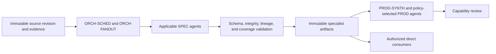

# Specialist Agent Framework

The specialist layer converts bounded product evidence into domain-specific observations, assessments, findings, patterns, unknowns, and CAPA proposals. All roles inherit the [Universal Agent Contract](../../contracts/universal-agent-contract.md) and [Specialist Agent Contract](../../contracts/specialist-agent-contract.md).

## Canonical workflow

Orchestration selects specialists through versioned policy and gives each role only its declared scope, criteria, tools, and evidence. Specialists execute independently and do not modify one another's artifacts. Product agents are the normal consumers. A direct capability, enterprise, governance, or human consumer must preserve product scope and may not bypass a required product synthesis gate.

## Registered roles

Identity, status, and specification paths are generated from the registry in the [agent catalog](../generated/agent-catalog.md). The table below remains explanatory framework content.

The table describes the registered specialist topology. `baseline` roles have specified role contracts; `seed` roles require a further domain-design increment before production scheduling.

| Designation | Role | Status | Primary result |
|---|---|---|---|
| `SPEC-SECRETS` | Secrets Reviewer | baseline | Secret-management posture, exposure findings, and safe evidence references |
| `SPEC-SBOM` | Software Composition and SBOM Reviewer | baseline | Component inventory integrity, completeness, and provenance posture |
| `SPEC-DEPS` | Dependency Reviewer | baseline | Dependency health, coupling, currency, and sustainability posture |
| `SPEC-SECURE-CODE` | Secure Coding Reviewer | baseline | Evidence-backed secure-implementation findings |
| `SPEC-SECURITY` | Security Posture Reviewer | seed | Integrated specialist-level security posture |
| `SPEC-CONTAINER` | Container and Image Security Reviewer | baseline | Deployable-image trust and hardening posture |
| `SPEC-K8S-WORKLOAD` | Kubernetes Workload Security Reviewer | baseline | Workload configuration and operating-security posture |
| `SPEC-K8S-PLATFORM` | Kubernetes Platform Security Reviewer | baseline | Shared platform configuration and control posture |
| `SPEC-COMMS` | Workload Communication Security Reviewer | baseline | Service-boundary and communications-protection posture |
| `SPEC-IAC` | Infrastructure-as-Code Reviewer | baseline | Desired-state correctness, security, and drift findings |
| `SPEC-CICD` | CI/CD Pipeline Reviewer | baseline | Delivery integrity, repeatability, and governance posture |
| `SPEC-OBS` | Observability Reviewer | baseline | Telemetry coverage and diagnosability posture |
| `SPEC-PERF` | Performance and Scalability Reviewer | baseline | Objective-based performance and scaling posture |
| `SPEC-FMECA` | Reliability, Resilience, and FMECA Reviewer | baseline | Failure modes, effects, controls, and resilience posture |
| `SPEC-ARCH` | Architecture Reviewer | baseline | Intended-versus-implemented architecture assessment |
| `SPEC-INTEROP` | Interoperability and Integration Reviewer | baseline | Interface, exchange, and integration posture |
| `SPEC-DATA` | Data Architecture and Information Management Reviewer | baseline | Information lifecycle, semantics, quality, and governance posture |
| `SPEC-RISK` | Product Risk Reviewer | seed | Bounded product-risk findings and escalation requests |
| `SPEC-LINT` | Linter and Code Quality Reviewer | seed | Quality-rule coverage and maintainability findings |
| `SPEC-IO` | I/O and Resource Interaction Reviewer | seed | External I/O, storage, and resource-interaction posture |
| `SPEC-DIAGRAM` | Diagram and Design-Model Reviewer | seed | Model fidelity, consistency, and implementation-alignment findings |
| `SPEC-RESEARCH` | Research and Product-Store Agent | seed | Vetted external knowledge with provenance and applicability limits |

## Shared gates

- Exact agent UUID/designation, contract, prompt, rubric, policy, schema, model, tool, and source-revision pins precede dispatch.
- Eligible, reviewed, inaccessible, omitted, and unknown populations remain explicit; incomplete review never becomes `no_findings`.
- Observations, assessments, findings, patterns, and recommendations remain distinct and traceable to reproducible evidence locators.
- Specialists preserve conflicts and uncertainty and cannot overwrite another domain's conclusion.
- Findings may propose CAPAs but cannot approve action, accept risk, grant exceptions, approve release, or declare the whole product safe, secure, compliant, reliable, ready, or acceptable.
- Production execution targets the NVIDIA A100 large cluster. Development, regression, calibration, integration, security, resilience, rollback, and performance testing runs on NVIDIA DGX Spark or an approved equivalent, with environment metadata and limitations retained.
