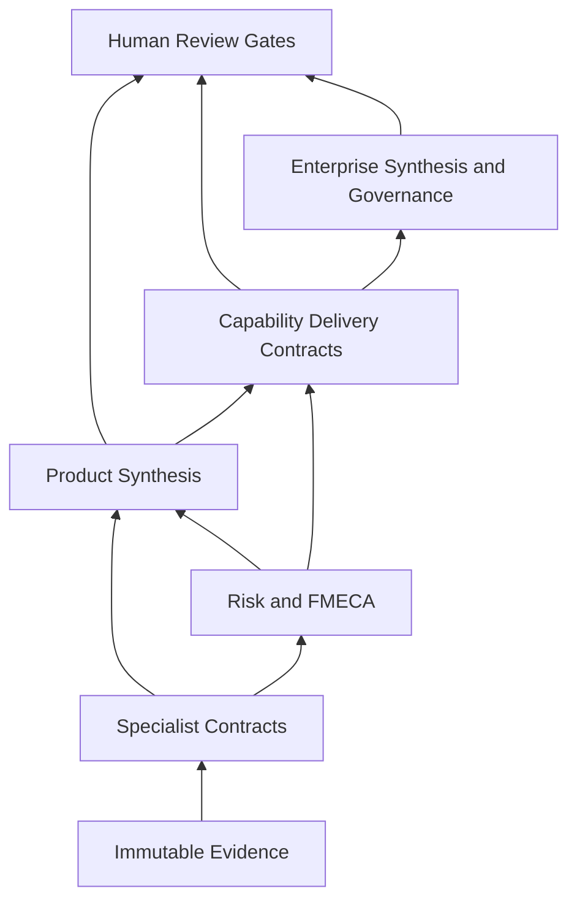

# Contract Dependency Graph

The orchestrator schedules a parent only when declared prerequisite artifacts are present or a policy-approved `incomplete_input` condition exists. Conflict objects are dependencies, not errors to discard.
