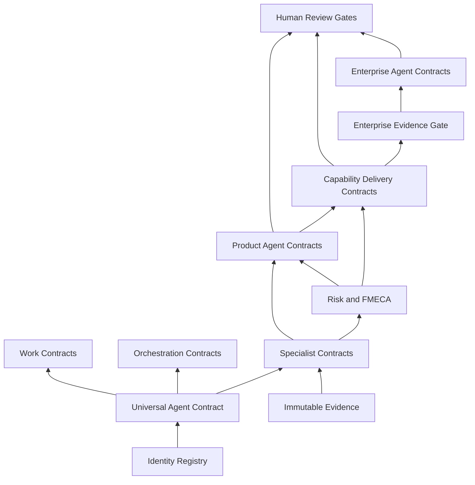

# Contract Dependency Graph

`ORCH-SCHED` resolves immutable agent identities and pins contract versions. `ORCH-FANOUT` dispatches bounded independent work. `ORCH-FANIN` schedules a parent only when declared prerequisite artifacts are valid and present or a policy-approved `incomplete_input` condition exists. Conflict objects are dependencies, not errors to discard.
