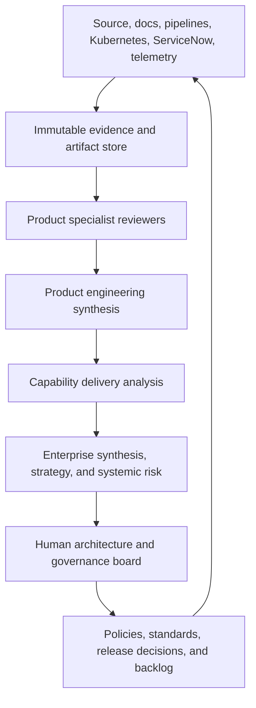

# OV-1: Operational Concept

```mermaid
flowchart TB
  SRC[Source, docs, pipelines, Kubernetes, ServiceNow, telemetry] --> STORE[Immutable evidence and artifact store]
  STORE --> SPEC[Product specialist reviewers]
  SPEC --> PROD[Product engineering synthesis]
  PROD --> CAP[Capability delivery analysis]
  CAP --> ENT[Enterprise synthesis, strategy, and systemic risk]
  ENT --> HUMAN[Human architecture and governance board]
  HUMAN --> FACTORY[Policies, standards, release decisions, and backlog]
  FACTORY --> SRC
```
